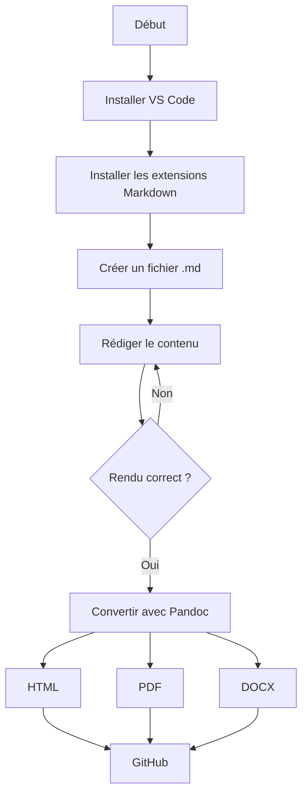

# Mon Profil 


## A propos de moi

Passionné par le développement web, les réseaux Cisco et le droit constitutionnel.  
J'aime coder des projets pratiques en Java, Bash et maintenant HTML/CSS.

### Mes competences 
Étapes d'apprentissage récentes :

1. HTML/CSS de base maîtrisé
2. JavaScript interactif en cours
3. Réseaux Cisco (Packet Tracer)

### Langages maîtrisés
- Langage C
- HTML/CSS
- SQL basique
- Java

### Outils favoris
- **Éditeur** : VS Code & Eclipse  
- **OS** : Ubuntu/Linux, Windows  
- **Réseaux** : Cisco Packet Tracer, SSH/DHCP

### Projets & Expériences
- Présentations académiques sur les réseaux.  
- Configuration de serveurs Linux.  
- Informaticien contractant du MTPCT-DDSE.  

### Contact
Envoie‑moi un email ou appelle‑moi directement !

- **Email** : [antoinebrian402@gmail.com](mailto:antoinebrian402@gmail.com)  
- **Téléphone** : +509 3648 5148 ([appeler](tel:+50936485148))

---

### Agenda du week-end 

| Heure   | Vendredi        | Samedi   | Dimanche |
|---------|-----------------|----------|----------|
| 8h-10h  | Travail         | Sport    | Eglise   |
| 10h-16h | Travail & Cours | Cours    | Devoir   |
| 17h-19h | Training        | Football | Sortie   |

Ce tableau illustre la liste des tâches effectuées chaque week-end.

---

### Diagramme de Mermaid


---

### Liste de tâches à faire

- [x] Installer Pandoc  
- [x] Créer le fichier Markdown  
- [ ] Tester la conversion en HTML  
- [ ] Tester la conversion en PDF  
- [ ] Tester la conversion en DOCX  

---

### Blocs de code

#### Python
```python
def saluer(nom):
    return f"Bonjour, {nom} !"

print(saluer("Markdown"))
```

#### Bash — Conversion Pandoc
```bash
pandoc MonProfil.md -o MonProfil.html
pandoc MonProfil.md -o MonProfil.docx
pandoc MonProfil.md -o MonProfil.pdf --pdf-engine=xelatex
```

#### SQL
```sql
SELECT nom, prenom, filiere
FROM etudiants
WHERE moyenne >= 14.0
ORDER BY moyenne DESC;
```

---

### HTML inline

<div style="background-color:#f0f8ff; padding:12px; border-left:4px solid #007acc;">
  <strong>Note :</strong> Ce bloc est écrit en HTML directement dans Markdown.
  <p style="color:red;">Ce texte est en rouge grâce au HTML inline.</p>
</div>

---

### &copy; Brian ANTOINE